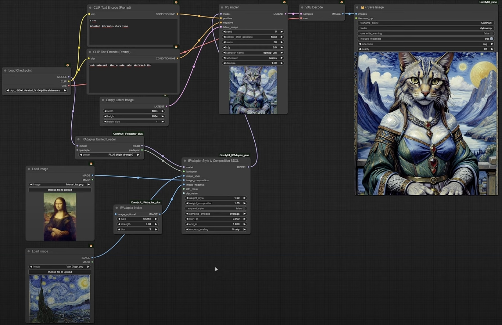

# Awesome ComfyUI
List of rencent awesome ComfyUI workflows

## ComfyUI Resources
- [ComfyUI](https://github.com/comfyanonymous/ComfyUI): Official Repo
- [Creating Custom Node](https://github.com/foxtrot-roger/comfyui-custom-nodes): Guide for creating custom node in ComfyUI

## Awesome Workflows
### Face Manipulation
- [Fast Face Swap](https://github.com/Gourieff/comfyui-reactor-node?tab=readme-ov-file) The Fast and Simple Face Swap Extension Node for ComfyUI, based on ReActor SD-WebUI Face Swap Extension
  

- [Face 2 Many](https://github.com/fofr/cog-face-to-many) Turn any face into 3D, pixel art, video game, claymation or toy.

- [Face 2 Sticker](https://github.com/fofr/cog-face-to-sticker) Turn any face into sticker!

### Style Transfer
- [IPAdapter](https://github.com/cubiq/ComfyUI_IPAdapter_plus) 1-image lora! Transfer the style from single image to other (composition, style, etc.)

### Photo-Realistic Image Restoration
- [Image Upscaling](https://github.com/kijai/ComfyUI-SUPIR) ComfyUI SUPIR upscaler wrapper node
  

# Resources
- [Training Scripts](https://github.com/ostris/ai-toolkit)
